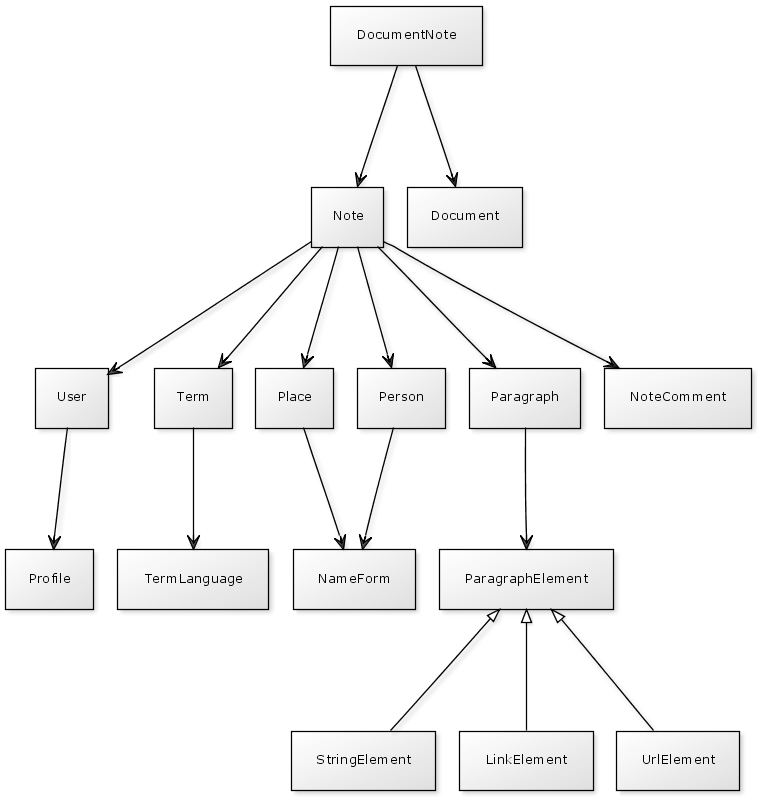

# Suomen Kirjallisuuden Seuran editioalustan tekninen kuvaus

## Sovelluksen perusteknologiat

Ohjelmisto on toteutettu käyttäen Java-ohjelmointikieltä. 
Sovelluspalvelimena käytetään Jettyä.

Dokumenttien tallennukseen ja versiointiin käytetään Subversion:ia.
Viitteet, henkilöt ym. talletetaan käyttäen Myseman kehittämää RDFBean:ia
Sesame RDF tietokantaan. Tietokannan sisältämän tiedon saa ulos esimerkiksi
erilaisten RDF-serialisointiformaattien muodossa kuten Turtle:na tai
RDF/XML:nä. Tietokantaan tapahtuvat kyselyt hoidetaan käyttäen meidän
kehittämää Querydsl:iä.

Käyttöliittymän toteutus on tapahtunut käyttämällä Apache Tapestryä,
jQuery:ä ja normaaleita web-teknologioita kuten CSS:ää ja JavaScript:iä.

Koko tämä pyörii tällä hetkellä teidän palvelimella, jonka
käyttöjärjestelmänä on Linux-pohjainen openSUSE 11.2. Tämä ei kuitenkaan
ole mikään vaatimus ohjelmiston toimimiselle.

Kaikki ohjelmiston käyttämät komponentit ovat avointa lähdekoodia.

## Kuvaus sovelluksen toiminnasta

Editioalusta on verkkosovellus, jolla kirjautunut käyttäjä voi liittää
versionhallinnassa oleviin XML-tiedostoihin annotaatioita. Annotaatioihin
voi liittää metatietoa, joka talletetaan tietokantaan. Järjestelmä
tarjoaa metatiedoille haun ja mahdollisuuden muokkaukseen sekä poistoon.

## Käsitemalli

### Selitykset

* DocumentNote = dokumenttiin liitetty viite
* Note = yleinen viite
* Document = dokumentti
* User = sovelluksen käyttäjä
* Term = perusmuoto
* Place = paikka
* Person = henkilö
* Paragraph = teksti
* NoteComment = viiitteen kommentti
* Profile = profiili
* TermLanguage = termin kieli
* NameForm = nimimuoto
* ParagraphElement = tekstin osa
* StringElement = teksti
* LinkElement = bibliografinen viite
* UrlElement = suora linkki
